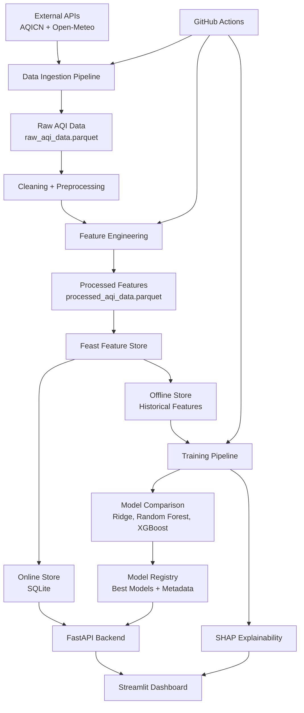
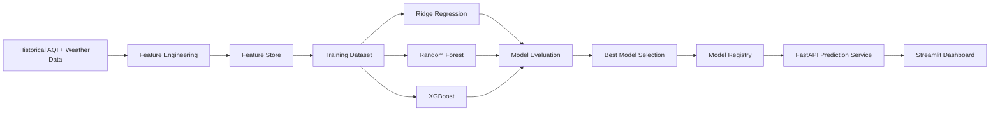
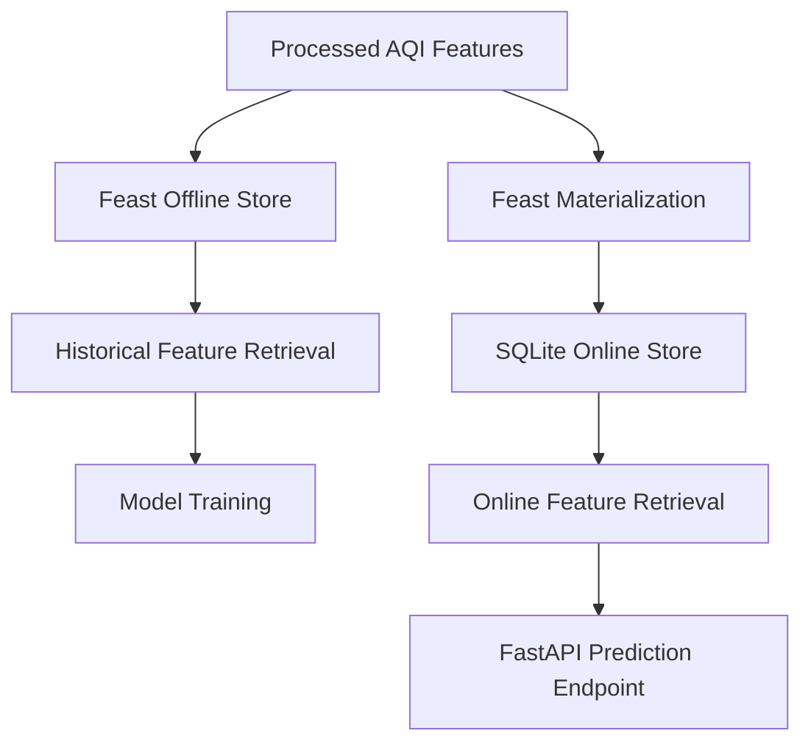
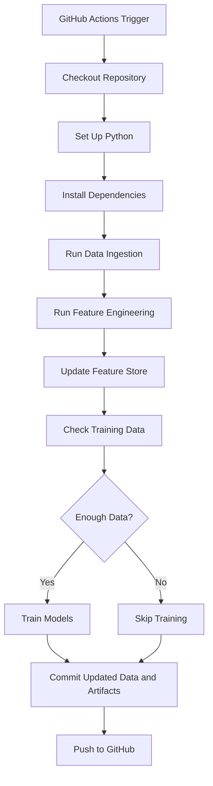

# Islamabad Air Quality Index Predictor

An end-to-end machine learning system for predicting Islamabad’s Air Quality Index for the next **24, 48, and 72 hours** using real AQI and weather data. The project includes automated data ingestion, feature engineering, Feast-based feature store integration, model training, model registry, SHAP explainability, health advisories, and an interactive Streamlit dashboard.

---

## Project Overview

Air pollution is a serious public health concern, especially in urban areas. This project predicts future AQI values for Islamabad using real-time and historical AQI/weather data. The system is designed as a complete ML pipeline rather than only a notebook-based model.

The pipeline collects data from external APIs, processes and engineers features, stores them in a feature store, trains multiple machine learning models, saves the best models in a model registry, and serves predictions through a FastAPI backend and Streamlit dashboard.

---

## Key Features

* Real AQI and weather data ingestion
* Automated hourly data pipeline using GitHub Actions
* Historical AQI data backfill for model training
* Feature engineering with lag, rolling, time-based, and ratio features
* Feast Feature Store integration
* Offline feature retrieval for training
* Online feature retrieval using Feast SQLite online store
* 24h, 48h, and 72h AQI forecasting
* Multiple model training and comparison
* Model registry with saved model artifacts and metadata
* SHAP explainability plots for model interpretation
* Health advisory system based on AQI categories
* Interactive Streamlit dashboard
* FastAPI backend for predictions and model serving
* Model retraining support
* Git-based version control and CI/CD workflow

---

## Technology Stack

| Category             | Tools / Libraries             |
| -------------------- | ----------------------------- |
| Programming Language | Python                        |
| Data Processing      | Pandas, NumPy                 |
| Machine Learning     | Scikit-learn, XGBoost         |
| Feature Store        | Feast                         |
| Model Registry       | Local model artifact registry |
| Explainability       | SHAP                          |
| Backend API          | FastAPI, Uvicorn              |
| Dashboard            | Streamlit, Plotly             |
| Automation           | GitHub Actions                |
| Data Format          | Parquet                       |
| Version Control      | Git, GitHub                   |

---

## System Architecture



---

## Machine Learning Workflow



---

## Feature Store Design

The project uses **Feast** as the feature store layer.

### Offline Store

The offline store is used for model training. Processed historical features are stored in Parquet format and retrieved through Feast.

```text
data/processed/processed_aqi_data.parquet
```

### Online Store

The online store is used for real-time feature retrieval during prediction serving.

```text
feature_store/data/feast/online_store.db
```

### Feast Entity

```text
Entity: city
Value: islamabad
```

### Feature View

```text
FeatureView: aqi_islamabad_features
```

### Feature Store Flow



---

## Forecasting Horizons

The system predicts AQI for:

| Horizon | Meaning                |
| ------- | ---------------------- |
| 24h     | Next day AQI forecast  |
| 48h     | Two-day AQI forecast   |
| 72h     | Three-day AQI forecast |

---

## Models Trained

The training pipeline compares multiple models:

* Ridge Regression
* Random Forest Regressor
* XGBoost Regressor

Models are evaluated using:

* RMSE
* MAE
* R² Score

The best model for each forecast horizon is saved in the model registry.

---

## Model Registry

Trained models and metadata are stored inside:

```text
artifacts/models/
```

Example artifacts:

```text
best_24h.json
best_48h.json
best_72h.json

random_forest_24h.joblib
random_forest_48h.joblib
random_forest_72h.joblib

ridge_24h.joblib
ridge_48h.joblib
ridge_72h.joblib

xgboost_24h.joblib
xgboost_48h.joblib
xgboost_72h.joblib
```

Each model metadata file contains performance metrics, training timestamp, feature names, and model information.

---

## Dashboard Features

The Streamlit dashboard includes:

### Dashboard Page

* Current AQI
* Temperature
* Humidity
* Wind speed
* AQI history chart
* Pollutant readings chart
* Health advisory message

### Forecast Page

* 24h AQI prediction
* 48h AQI prediction
* 72h AQI prediction
* Forecast trend visualization

### Model Metrics Page

* Model comparison table
* RMSE comparison chart
* MAE and R² values

### SHAP Explainability Page

* SHAP summary plots
* SHAP bar plots
* Feature importance visualization for each forecast horizon

### Drift Status Page

* Feature drift status
* Drift ratio
* Drifted feature names
* Drift trend chart, if drift history is available

### Health Advisory Page

* Current AQI category
* Health recommendation
* AQI category reference table

### Retrain Page

* Manual model retraining trigger from dashboard

---

## Dashboard Preview

Add your screenshots here:

```text
docs/screenshots/dashboard.png
docs/screenshots/forecast.png
docs/screenshots/model_metrics.png
docs/screenshots/shap_explainability.png
docs/screenshots/github_actions.png
```

Example:

```markdown


```

---

## Project Structure

```text
Air-Quality-Index-Predictor/
│
├── artifacts/
│   └── models/
│       ├── best_24h.json
│       ├── best_48h.json
│       ├── best_72h.json
│       ├── random_forest_24h.joblib
│       ├── random_forest_48h.joblib
│       ├── random_forest_72h.joblib
│       ├── ridge_24h.joblib
│       ├── ridge_48h.joblib
│       └── ridge_72h.joblib
│
├── config/
│   └── config.yaml
│
├── configs/
│   └── config.yaml
│
├── data/
│   ├── raw/
│   │   └── raw_aqi_data.parquet
│   └── processed/
│       └── processed_aqi_data.parquet
│
├── feature_store/
│   ├── feature_store.yaml
│   ├── features.py
│   └── data/
│       └── feast/
│
├── plots/
│   ├── shap_summary_24h.png
│   ├── shap_bar_24h.png
│   ├── shap_summary_48h.png
│   ├── shap_bar_48h.png
│   ├── shap_summary_72h.png
│   └── shap_bar_72h.png
│
├── pipelines/
│   ├── run.py
│   └── run_backfill.py
│
├── src/
│   ├── api/
│   │   ├── main.py
│   │   ├── routes.py
│   │   └── schemas.py
│   │
│   ├── dashboard/
│   │   └── app.py
│   │
│   ├── feature_store/
│   │   └── feature_registry.py
│   │
│   ├── feature_engineering/
│   ├── ingestion/
│   ├── intelligence/
│   │   ├── alerting.py
│   │   ├── drift_detector.py
│   │   ├── explainability.py
│   │   └── health_advisor.py
│   │
│   ├── training/
│   │   ├── trainer.py
│   │   └── model_registry.py
│   │
│   └── utils/
│       ├── helpers.py
│       └── logger.py
│
├── .github/
│   └── workflows/
│       └── hourly_data_ingestion.yml
│
├── requirements.txt
└── README.md
```

---

## Setup Instructions

### 1. Clone the Repository

```bash
git clone https://github.com/MaryamCodeHub/Air-Quality-Index-Predictor.git
cd Air-Quality-Index-Predictor
```

### 2. Create a Virtual Environment

For Windows PowerShell:

```powershell
python -m venv .venv
.\.venv\Scripts\activate
```

For Linux/macOS:

```bash
python -m venv .venv
source .venv/bin/activate
```

### 3. Install Dependencies

```bash
python -m pip install --upgrade pip
python -m pip install -r requirements.txt
```

### 4. Add Environment Variables

Create GitHub secret or local environment variable for AQICN:

```text
AQICN_API_KEY=your_api_key_here
```

---

## Running the Project Locally

### 1. Run Data Ingestion

```bash
python pipelines/run.py ingest
```

### 2. Run Feature Pipeline

```bash
python pipelines/run.py features
```

### 3. Train Models

```bash
python pipelines/run.py train
```

### 4. Generate SHAP Explanations

```bash
python pipelines/run.py explain
```

### 5. Run Drift Detection

```bash
python pipelines/run.py drift
```

### 6. Start FastAPI Backend

```bash
python -m uvicorn src.api.main:app --host 127.0.0.1 --port 8000
```

FastAPI docs:

```text
http://127.0.0.1:8000/docs
```

### 7. Start Streamlit Dashboard

Open a new terminal:

```bash
python -m streamlit run src/dashboard/app.py
```

Dashboard URL:

```text
http://localhost:8501
```

---

## API Endpoints

| Endpoint                | Method | Description                      |
| ----------------------- | ------ | -------------------------------- |
| `/api/v1/predict`       | POST   | Predict AQI for selected horizon |
| `/api/v1/health-advice` | GET    | Get current AQI health advisory  |
| `/api/v1/metrics`       | GET    | Get model performance metrics    |
| `/api/v1/drift-status`  | GET    | Get latest drift status          |
| `/api/v1/drift-history` | GET    | Get drift monitoring history     |
| `/api/v1/retrain`       | POST   | Trigger model retraining         |

### Example Prediction Request

```powershell
Invoke-RestMethod `
  -Uri "http://127.0.0.1:8000/api/v1/predict" `
  -Method POST `
  -ContentType "application/json" `
  -Body '{"horizon":24}'
```

Example response:

```json
{
  "city": "Islamabad",
  "horizon_hours": 24,
  "predicted_aqi": 66.2,
  "model_used": "random_forest",
  "health_advisory": {
    "aqi": 66.2,
    "level": "Moderate",
    "color": "yellow",
    "advice": "Acceptable. Sensitive individuals should reduce prolonged outdoor exertion."
  },
  "timestamp": "2026-06-06T00:26:04"
}
```

---

## GitHub Actions Automation

The project uses GitHub Actions for automated pipeline execution.

### Workflow Responsibilities

* Runs hourly
* Fetches latest AQI/weather data
* Updates raw and processed Parquet files
* Runs feature engineering
* Updates Feast feature store
* Checks if enough data is available
* Trains models when required
* Commits updated data and artifacts back to GitHub

### Workflow Diagram



---

## AQI Health Advisory Categories

| AQI Range | Category                       | Recommendation                                         |
| --------- | ------------------------------ | ------------------------------------------------------ |
| 0–50      | Good                           | Air quality is satisfactory                            |
| 51–100    | Moderate                       | Sensitive individuals should reduce prolonged exertion |
| 101–150   | Unhealthy for Sensitive Groups | Wear masks outdoors and reduce prolonged exposure      |
| 151–200   | Unhealthy                      | Everyone may experience health effects                 |
| 201–300   | Very Unhealthy                 | Avoid outdoor activities                               |
| 301–500   | Hazardous                      | Health emergency, stay indoors                         |

The advisory system handles decimal AQI values by using rounded values for category matching while preserving the displayed decimal AQI.

---

## Explainability

SHAP is used to explain the contribution of features to model predictions.

Generated plots include:

```text
shap_summary_24h.png
shap_bar_24h.png
shap_summary_48h.png
shap_bar_48h.png
shap_summary_72h.png
shap_bar_72h.png
```

These plots help identify the most influential features for AQI forecasting, such as:

* Current AQI
* PM2.5
* PM10
* Temperature
* Humidity
* Rolling AQI averages
* Lag features
* Time-based features

---

## Feature Engineering

The pipeline generates multiple feature groups:

### Time-Based Features

* Hour
* Day of week
* Day of month
* Month
* Weekend indicator
* Season

### Cyclical Features

* Hour sine/cosine
* Month sine/cosine

### Rolling Features

* AQI rolling mean
* AQI rolling standard deviation
* PM2.5 rolling mean
* PM10 rolling mean

### Lag Features

* AQI lag 1h
* AQI lag 3h
* AQI lag 6h
* AQI lag 12h
* AQI lag 24h

### Ratio Features

* PM2.5 / PM10 ratio
* O3 / NO2 ratio

---

## Current Project Status

| Pillar                  | Status   |
| ----------------------- | -------- |
| Data Ingestion          | Complete |
| Feature Engineering     | Complete |
| Feature Store           | Complete |
| Model Training          | Complete |
| Model Registry          | Complete |
| 3-Day Forecasting       | Complete |
| FastAPI Backend         | Complete |
| Streamlit Dashboard     | Complete |
| SHAP Explainability     | Complete |
| GitHub Actions Pipeline | Complete |

---

## Known Limitations

* Forecast quality depends on the availability and reliability of external AQI and weather APIs.
* Some pollutant values may be missing in real-time API responses.
* Commercial AQI providers may use different data sources, sensors, and proprietary forecasting models, so predictions may differ from external platforms.
* Retraining from the dashboard may take longer depending on system resources.
* The current setup uses a local Feast provider and SQLite online store, suitable for a student/internship project and local deployment.

---

## Future Improvements

* Deploy dashboard and backend to cloud
* Add Hopsworks or Vertex AI as a managed feature store
* Use forecasted weather variables for future horizons
* Add deep learning models such as LSTM or GRU
* Add model monitoring dashboards
* Add asynchronous retraining jobs
* Add notification alerts for hazardous AQI
* Support multiple cities
* Add Docker support
* Add unit tests and CI validation checks

---

## Author

**Maryam Naseem**
BSIT Student | Data Science Intern | Machine Learning Enthusiast

GitHub: [MaryamCodeHub](https://github.com/MaryamCodeHub)

---

## Acknowledgement

This project was developed as part of a Data Science internship project to build a complete, automated, serverless AQI forecasting system using real data, machine learning, feature store concepts, and dashboard-based visualization.

---

## License

This project is for educational and internship evaluation purposes.
